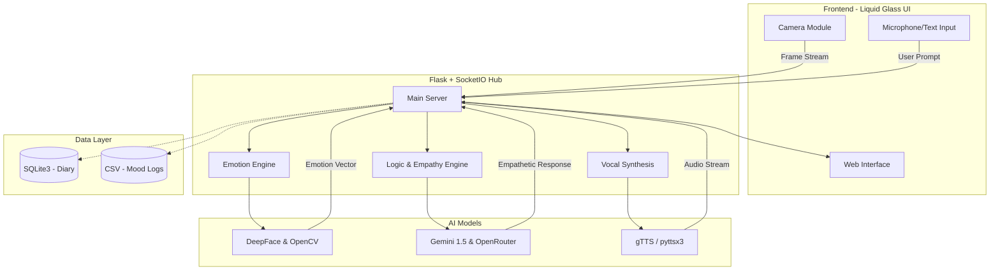
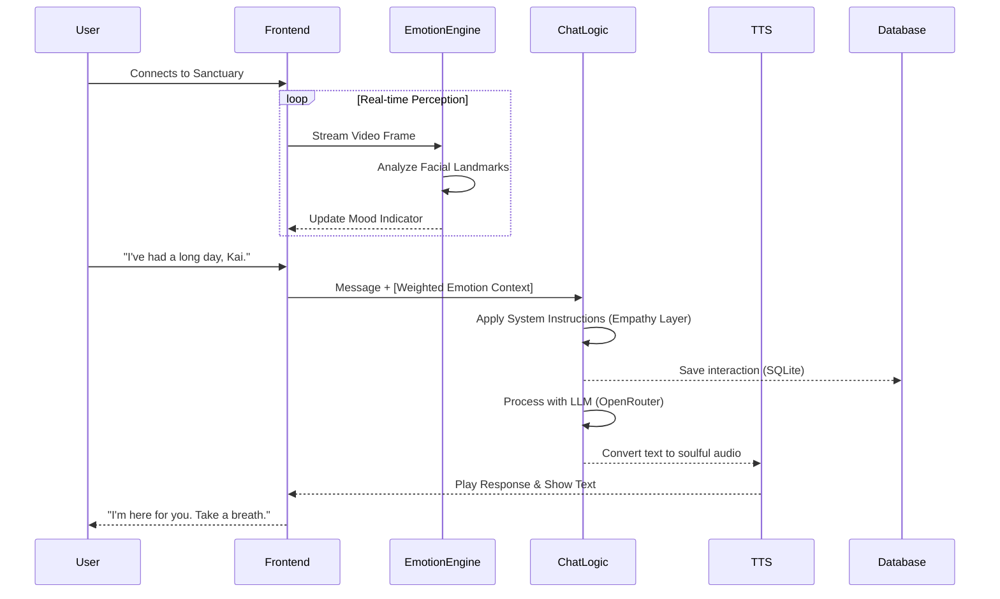

# 🌌 KAI: The Companion
### *Your Soulful AI Reflection and Emotional Sanctuary*

[](https://github.com/RutujaKumbhar17/KAI-The-Companion)
[](https://opensource.org/licenses/MIT)
[](https://www.python.org/downloads/)

KAI (Knowledgeable Artificial Intelligence) is more than just a chatbot; it is a **multimodal emotional companion** designed to bridge the gap between human sentiment and artificial intelligence. Built with a focus on empathy, aesthetics, and mental well-being, KAI leverages computer vision and advanced language models to provide a sanctuary for self-reflection and connection.

---

## 🏗️ System Architecture

KAI's architecture is built on a **Real-time Asynchronous Hub** model, ensuring that visual perception and conversational logic happen simultaneously without lag.



---

## 🌊 Seamless Data Flow

Understanding how KAI perceives and reacts to you is key to its "soulful" experience.



---

## 🧩 Core Project Sections

### 1. 🏡 The Landing Hub
The entryway to your sanctuary. A minimalist, welcoming interface designed to transition the user from the chaos of the digital world into a calm, focused environment.

### 2. 🛡️ The Sanctuary Dashboard
A personalized "Bento-style" dashboard that visualizes your emotional journey.
- **Mood Spectrum**: Distribution of your top emotions.
- **Glow Gallery**: A curated collection of captured moments of happiness (Faceography).
- **Activity Sprout**: Tracks your daily consistency (Streak) in self-reflection.

### 3. 💬 KAI Companion (The Chat)
The heart of the project. A dedicated chat interface where KAI uses your current visual mood to adjust its tone. KAI doesn't just read; KAI **sees**.

### 4. 📖 The Diary (Soulful Notes)
A persistent journaling system with mood-based templates. Whether you're feeling grateful or overwhelmed, the diary provides the right prompt to help you express yourself.

### 5. 📽️ Faceography (Joy Captures)
KAI automatically captures moments when you smile or show genuine joy, storing them in your personal "Glow Gallery" to remind you of your best moments.

---

## 🛠️ Technology Stack

| Layer | Technologies |
| :--- | :--- |
| **Core Backend** | Flask, Flask-SocketIO, Eventlet |
| **Frontend** | Vanilla CSS (Liquid Glass), JavaScript, Jinja2 |
| **Intelligence** | Gemini 1.5 Flash, OpenRouter (GPT-4o), Google GenAI |
| **Vision** | OpenCV, DeepFace, TensorFlow |
| **Audio/Voice** | pyttsx3, gTTS |
| **Data** | SQLite3, Pandas, CSV |

---

## ⚖️ Comparative Analysis

How KAI stands out in the real-world landscape of AI tools:

| Feature | Standard AI Chatbots | Mood Tracking Apps | **KAI: The Companion** |
| :--- | :--- | :--- | :--- |
| **Sentiment Analysis** | Text-only (Basic) | Manual Entry | **Real-time Facial Perception** |
| **Empathy Level** | Informational/Neutral | None | **Adaptive Emotional Tone** |
| **Memory** | Session-based | Static History | **Persistent Emotional Growth** |
| **Interaction** | Text only | Multiple Choice | **Multimodal (Voice + Vision + Text)** |
| **UI Aesthetics** | Utility-focused | Simple/Functional | **Liquid Glass / Premium Design** |

---

## 🔥 Why KAI is Superior?

1. **Vision-Integrated Empathy**: Unlike GPT or Claude, KAI uses your camera feed to detect if you are sad, happy, or angry *before* you even type a word, adjusting its response accordingly.
2. **Privacy-First Logging**: Data is stored locally in SQLite and CSV, giving the user full control over their emotional history.
3. **The "Glow" Philosophy**: KAI focuses on positive reinforcement through the Joy Gallery, turning AI from a tool into a mental health ally.
4. **Zero-Latency Interactions**: Optimized with SocketIO for instantaneous feedback loops.

---

## 🚀 Installation & Usage

### Prerequisites
- Python 3.9+
- Camera hardware
- Google Gemini API Key

### Step 1: Clone the Repository
```bash
git clone https://github.com/RutujaKumbhar17/KAI-The-Companion.git
cd KAI-The-Companion
```

### Step 2: Install Dependencies
```bash
pip install -r requirements.txt
```

### Step 3: Configure Environment
Edit `config.py` and add your API credentials:
```python
apikey = "YOUR_GEMINI_API_KEY"
model_name = "gemini-1.5-flash"
```

### Step 4: Launch the Sanctuary
```bash
python app.py
```
*Access the dashboard at `http://127.0.0.1:5002`*

---

## 🔮 Future Enhancements
- [ ] **Multi-User Profiles**: Personalized emotional memory for different family members.
- [ ] **Wearable Integration**: Syncing heart rate data (e.g., Apple Watch) for deeper anxiety detection.
- [ ] **VR Sanctuary**: A fully immersive 3D environment for meditation alongside KAI.
- [ ] **Global Mood map**: Anonymous, aggregated mood trends to visualize collective well-being.

---

## 🔗 Connect With Us
- **Project Link**: [https://github.com/RutujaKumbhar17/KAI-The-Companion](https://github.com/RutujaKumbhar17/KAI-The-Companion)
- **Author**: Rutuja Kumbhar

---
*Made with ❤️ and ☕ to bring peace into the digital age.*
