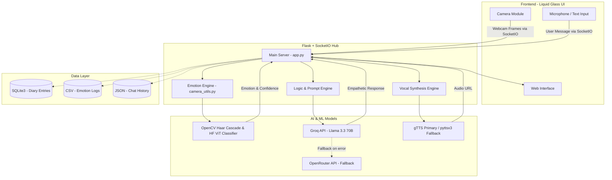
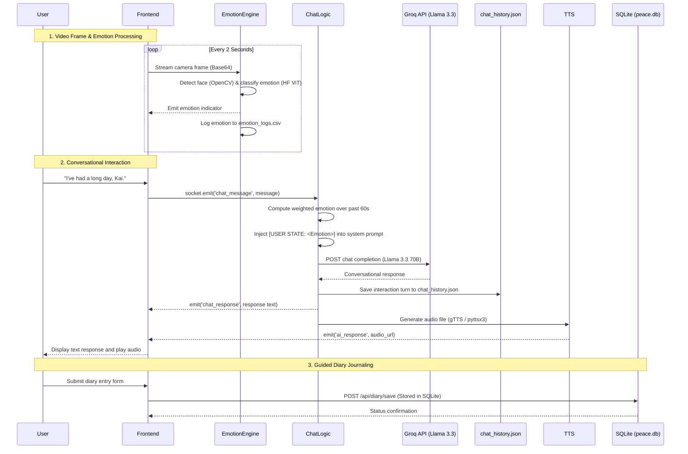

# 🌌 KAI: The Companion
### *Your Soulful AI Reflection and Emotional Sanctuary*

[](https://github.com/RutujaKumbhar17/KAI-The-Companion)
[](https://opensource.org/licenses/MIT)
[](https://www.python.org/downloads/)

KAI is an experimental **multimodal emotional companion** that bridges human sentiment and artificial intelligence. Built with a focus on empathy, calm aesthetics, and self-reflection, KAI combines local computer vision emotion detection with conversational language models to create a personalized digital sanctuary.

- 🌐 [Live Demo](https://huggingface.co/spaces/rutujakumbhar/KAI-The-Companion)

---

## 🏗️ System Architecture

KAI uses an asynchronous **Flask + SocketIO Hub** architecture to handle video frame analysis, user prompts, speech synthesis, and persistent logging concurrently.


```mermaid
graph TD
    subgraph Client_Side [Frontend - Liquid Glass UI]
        UI[Web Interface]
        CAM[Camera Module]
        MIC[Microphone / Text Input]
    end

    subgraph Backend_Server [Flask + SocketIO Hub]
        SRV[Main Server - app.py]
        EMO[Emotion Engine - camera_utils.py]
        LLM[Logic & Prompt Engine]
        TTS[Vocal Synthesis Engine]
    end

    subgraph Intelligence_Layer [AI & ML Models]
        CV[OpenCV Haar Cascade & HF ViT Classifier]
        GQ[Groq API - Llama 3.3 70B]
        OR[OpenRouter API - Fallback]
        GT[gTTS Primary / pyttsx3 Fallback]
    end

    subgraph Persistence [Data Layer]
        DB[(SQLite3 - Diary Entries)]
        LOG[(CSV - Emotion Logs)]
        HIST[(JSON - Chat History)]
    end

    CAM -->|Webcam Frames via SocketIO| SRV
    SRV --> EMO
    EMO --> CV
    CV -->|Emotion & Confidence| SRV

    MIC -->|User Message via SocketIO| SRV
    SRV --> LLM
    LLM --> GQ
    GQ -.->|Fallback on error| OR
    GQ -->|Empathetic Response| SRV

    SRV --> TTS
    TTS --> GT
    GT -->|Audio URL| SRV

    SRV --> UI
    SRV -.-> DB
    SRV -.-> LOG
    SRV -.-> HIST
```

---

## 🌊 Seamless Data Flow

Here is how KAI processes visual emotion signals alongside conversational chat in real time:


```mermaid
sequenceDiagram
    participant User
    participant Frontend
    participant EmotionEngine
    participant ChatLogic
    participant GroqLLM as Groq API (Llama 3.3)
    participant ChatLog as chat_history.json
    participant TTS
    participant DiaryDB as SQLite (peace.db)

    Note over User,Frontend: 1. Video Frame & Emotion Processing
    loop Every 2 Seconds
        Frontend->>EmotionEngine: Stream camera frame (Base64)
        EmotionEngine->>EmotionEngine: Detect face (OpenCV) & classify emotion (HF ViT)
        EmotionEngine-->>Frontend: Emit emotion indicator
        EmotionEngine->>EmotionEngine: Log emotion to emotion_logs.csv
    end

    Note over User,Frontend: 2. Conversational Interaction
    User->>Frontend: "I've had a long day, Kai."
    Frontend->>ChatLogic: socket.emit('chat_message', message)
    ChatLogic->>ChatLogic: Compute weighted emotion over past 60s
    ChatLogic->>ChatLogic: Inject [USER STATE: <Emotion>] into system prompt
    ChatLogic->>GroqLLM: POST chat completion (Llama 3.3 70B)
    GroqLLM-->>ChatLogic: Conversational response
    ChatLogic->>ChatLog: Save interaction turn to chat_history.json
    ChatLogic-->>Frontend: emit('chat_response', response text)
    ChatLogic->>TTS: Generate audio file (gTTS / pyttsx3)
    TTS-->>Frontend: emit('ai_response', audio_url)
    Frontend-->>User: Display text response and play audio

    Note over User,DiaryDB: 3. Guided Diary Journaling
    User->>Frontend: Submit diary entry form
    Frontend->>DiaryDB: POST /api/diary/save (Stored in SQLite)
    DiaryDB-->>Frontend: Status confirmation
```

---

## 🧩 Core Project Sections

### 1. 🏡 The Landing Hub
A minimalist entryway designed to transition the user into a calm, focused environment.

### 2. 🛡️ The Sanctuary Dashboard
A personalized "Bento-style" dashboard visualizing emotional trends:
- **Mood Spectrum**: Aggregate breakdown of detected moods from session logs.
- **Glow Gallery**: Visual gallery displaying buffered captures and joy moments.
- **Activity Sprout**: Tracks consecutive days of journaling consistency.
- **Mindfulness Prompts**: Context-aware reflection suggestions based on recent mood.

### 3. 💬 KAI Companion (The Chat)
The conversational interface where KAI conditions its empathy on your recent facial mood. KAI receives a context tag (e.g. `[USER STATE: Happy]`) to adjust conversational warmth without robotically repeating the detected label.

### 4. 📖 The Diary (Soulful Notes)
A persistent journaling system backed by SQLite (`peace.db`) featuring structured prompts for gratitude, reflection, and self-expression.

### 5. 📽️ Faceography (Joy Captures)
During camera sessions, KAI buffers captured face frames in a local buffer (up to 50 frames), cataloging expressions in the gallery.

---

## 🛠️ Technology Stack

| Layer | Technologies | Role / Description |
| :--- | :--- | :--- |
| **Backend Core** | Flask, Flask-SocketIO, Eventlet, python-dotenv | Real-time WebSocket hub and REST API routing |
| **Frontend** | Vanilla CSS (Liquid Glass UI), JavaScript, Jinja2 | Responsive UI, camera frame capture, audio player |
| **Primary LLM** | Groq API (`llama-3.3-70b-versatile`) | Fast, empathetic conversational chat and mindfulness generation |
| **Fallback LLM** | OpenRouter API (`openai/gpt-3.5-turbo`) | Secondary chat completion fallback |
| **Vision & Emotion** | OpenCV (`cv2`), Hugging Face Transformers, PyTorch (CPU) | Face detection via Haar Cascade; emotion detection via `dima806/facial_emotions_image_detection` |
| **Speech (TTS)** | gTTS (Primary), pyttsx3 (Offline Fallback) | Vocal response synthesis served through static audio endpoints |
| **Data & Storage** | SQLite3, CSV, JSON, Pandas | SQLite for diary entries, CSV for emotion logs, JSON for chat logs |

---

## ⚖️ Comparative Analysis

How KAI compares with conventional chatbots and standalone mood tracking applications:

| Feature | Standard AI Chatbots | Mood Tracking Apps | **KAI: The Companion** |
| :--- | :--- | :--- | :--- |
| **Emotion Input** | Text sentiment only | Manual mood logging | **Real-time camera-based facial emotion detection** |
| **Tone Adaptation** | Prompt-dependent | Static rules / None | **Dynamic conversational tone guided by recent facial mood** |
| **Personal Journaling** | External / Prompt-driven | Structured questionnaires | **Integrated Diary with mood-based templates (SQLite)** |
| **Visual Memories** | None | Manual photo upload | **Session face frame buffering and Joy Gallery (Faceography)** |
| **Interaction Modality** | Text & Voice | Form inputs | **Multimodal: Video frame streaming, Voice (TTS), and Chat** |

---

## ✨ What Makes KAI Different

1. **Camera-Assisted Emotion Context**: Rather than relying only on typed messages, KAI observes facial expressions through your camera feed, injecting a weighted mood signal (e.g. happy, sad, neutral) into the conversation context to guide the assistant's empathy.
2. **Local Logging & Data Flow**: Conversations are logged to `logs/chat_history.json`, diary entries are saved to SQLite (`logs/peace.db`), and emotion timestamps are recorded in CSV. In local self-hosted setups, this data remains on your machine. When chatting, prompts are sent to third-party LLM APIs (Groq/OpenRouter). On hosted demos (like Hugging Face Spaces), data resides inside the container instance. (See [Privacy and Data Handling](#-privacy-and-data-handling)).
3. **The "Glow" Philosophy**: KAI saves and highlights moments of genuine joy captured during sessions, turning companion interactions into positive emotional reinforcement.
4. **WebSocket-Powered Streaming**: Utilizes Flask-SocketIO for low-latency bidirectional communication between camera frames, textual messages, and synthesized audio. Total response time depends on network latency and external LLM inference speeds.

---

## 🔒 Privacy and Data Handling

- **Local Storage**: When running locally, all databases (`logs/peace.db`), emotion logs (`logs/emotion_logs.csv`), and chat histories (`logs/chat_history.json`) are stored on your local filesystem and ignored from version control.
- **Hosted Demo Notice**: On public or cloud container instances (such as Hugging Face Spaces), logs and database files exist inside the container instance environment.
- **Third-Party AI Services**: User messages and system emotion tags are transmitted to third-party LLM providers (Groq and/or OpenRouter) to generate responses. Voice generation with gTTS communicates with Google TTS services.
- *A detailed privacy policy and retention configuration guide will be added in Phase 2.*

---

## ⚠️ Limitations & Disclaimer

- **Not Medical Advice**: KAI is an experimental AI companion designed for personal self-reflection and emotional well-being. It is **not** a diagnostic tool, medical device, or substitute for licensed therapy or clinical psychiatric care. If you are experiencing mental health distress or crisis, please contact professional medical services or crisis hotlines.
- **Vision Accuracy**: Facial emotion classification relies on a lightweight computer vision pipeline (Haar Cascade + ViT classifier) that may be influenced by lighting conditions, camera angles, facial hair, or occlusions. Detected emotions are heuristic indicators, not definitive psychological assessments.
- **API Dependencies**: Conversational responses and audio generation depend on external network connectivity and third-party API availability and rate limits.

---

## 🚀 Installation & Usage

### Prerequisites
- Python 3.10+ recommended
- Working camera / webcam hardware
- **Groq API Key** (Required for primary AI chat; free tier available at [console.groq.com](https://console.groq.com))
- OpenRouter API Key (Optional fallback)

### Step 1: Clone the Repository
```bash
git clone https://github.com/RutujaKumbhar17/KAI-The-Companion.git
cd KAI-The-Companion
```

### Step 2: Set Up Virtual Environment & Dependencies
```bash
python -m venv venv
# On Windows:
venv\Scripts\activate
# On Linux/macOS:
source venv/bin/activate

# Install PyTorch CPU first (required for Hugging Face image classification pipeline):
pip install torch --index-url https://download.pytorch.org/whl/cpu

# Install remaining dependencies:
pip install -r requirements.txt
```

### Step 3: Configure Environment
Copy the example environment template and configure your secrets:
```bash
cp .env.example .env
```

Open `.env` in your text editor and fill in your keys:
```bash
# Required
GROQ_API_KEY=your_actual_groq_api_key_here

# Optional defaults
GROQ_MODEL=llama-3.3-70b-versatile
PORT=5002
FLASK_DEBUG=0
DEBUG_DIAGNOSE=0
DIAGNOSE_TOKEN=
```

> ⚠️ **Important Security Rule**: Never commit your `.env` file or paste real API keys into version-controlled files.

### Step 4: Launch the Sanctuary
```bash
python app.py
```
*Access the application in your browser at `http://127.0.0.1:5002`*

---

## ☁️ Deployment (Hugging Face Spaces)

This repository includes a standardized `Dockerfile` optimized for containerized deployment on **Hugging Face Spaces**.

### Deployment Highlights
- **Base Environment**: Standardized on `python:3.10` Debian Bookworm image.
- **Headless OpenCV Libraries**: Packages `libgl1`, `libglx-mesa0`, and `libglib2.0-0` to satisfy OpenCV C++ runtime requirements without an X server.
- **Resilient Vision Loading**: Packages `haarcascade_frontalface_default.xml` in the repository root for offline face detection.
- **Protected Diagnostics**: Includes a token-protected `/diagnose` endpoint (enabled via `DEBUG_DIAGNOSE=1` and `DIAGNOSE_TOKEN`) for container health verification without exposing sensitive paths or tracebacks publicly.

### Deploying Your Own Space
1. Create a new Space on [Hugging Face](https://huggingface.co/spaces) and select **Docker** as the SDK.
2. In your Space settings (**Settings** -> **Variables and secrets**), add your secrets:
   - `GROQ_API_KEY` (Required)
   - `GROQ_MODEL` (Optional, defaults to `llama-3.3-70b-versatile`)
   - `OPENROUTER_API_KEY` (Optional fallback)
3. Link your local git repository and push:
   ```bash
   git remote add hf https://huggingface.co/spaces/YOUR_USERNAME/YOUR_SPACE_NAME
   git push hf main
   ```

---

## 🔮 Future Enhancements
- [ ] **Multi-User Profiles**: Personalized emotional memory and diary separation for different users.
- [ ] **Wearable Integration**: Syncing physiological indicators (e.g. heart rate) for multi-signal stress detection.
- [ ] **VR Sanctuary**: Immersive 3D environment for guided meditation alongside KAI.
- [ ] **Aggregated Insights**: Anonymized trend visualizations for personal wellness progress over time.

# Author
 ## 📧 Connect with Me
**Rutuja Maruti Kumbhar**

- 🌐 [My Portfolio](https://rutujakumbhar.netlify.app)

- 💼 [My LinkedIn](https://www.linkedin.com/in/rutuja-kumbhar-a7311b2a9/)

- 💻 [My GitHub](https://github.com/RutujaKumbhar17)

- 📧 [Email Id](https://rutujakumbhar.prof@gmail.com)
